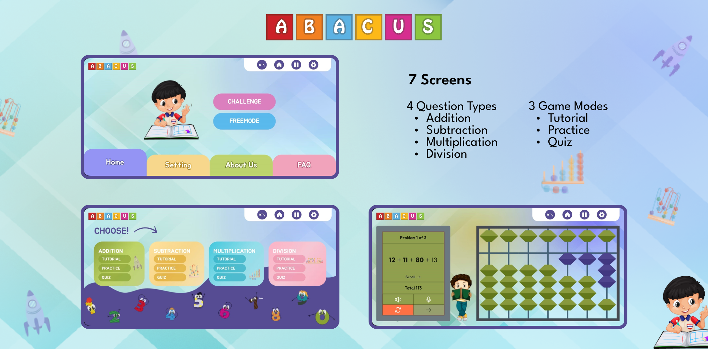

# abacus-game-flutter

An abacus game app I made with Flutter during my internship at [Robotics World Pvt Ltd](https://roboticsworld.com.pk/). The source code will not be uploaded on github.

<!-- banner image -->

## Features

- Game modes: Tutorial, Practice, Quiz 
- Question type: Addition, subtraction, multiplication, division
- Difficulty levels: Easy, Medium, Hard
- Speak question (Text-to-speech)
- Answer question by speaking (Speech-to-text)

## Try Yourself

You can try the application by running it on your device/emulator.

### Download

You can [download](https://github.com/mabdullah412/abacus-game-flutter/releases) the installable version of this app for android.
